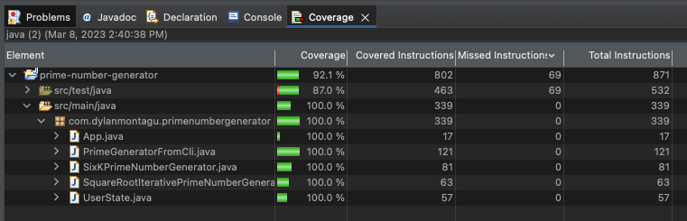

# Prime Number Generator

## Run Application

To build and run the prime number generator applicaiton, run the following commands from the root directory:

```
mvn clean package
java -jar  target/prime-number-generator-0.0.1.jar
```

## Things to improve going forward

- Implement Spring Boot framework to allow for dependency injection and easier configuration. The implementation of this project was set up with the intention to easy any transiton to a DI framework, I ultimately chose not to create a Spring Boot app as it seemed a little heavy weight for this project.
- PrimeGeneratorFromInterface and its CLI implementation is a little clunky when considered in the context of how extensible it is - ie, if I wanted to create an implementation to read from Files. Could be improved if I ultimately did want to implement that additional funcitonality. 


## Unit Test Coverage

